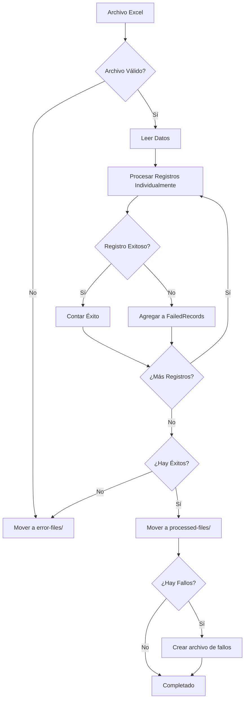

# 🔄 Manejo de Registros Fallidos

## 📋 Resumen

Se ha implementado una nueva funcionalidad que mejora significativamente el manejo de errores durante el procesamiento de archivos Excel. En lugar de mover todo el archivo a `error-files` cuando fallan algunos registros, ahora:

- **Registros exitosos**: Se procesan normalmente
- **Registros fallidos**: Se guardan en un nuevo archivo Excel en `error-files/`
- **Archivos corruptos**: Se mueven completamente a `error-files/`

## 🎯 Beneficios

### ✅ **Antes (Comportamiento Anterior)**

- Un solo registro fallido → Todo el archivo se movía a `error-files/`
- Pérdida de registros exitosos
- Reprocesamiento manual necesario
- Ineficiencia en el manejo de errores

### ✅ **Ahora (Nuevo Comportamiento)**

- Registros fallidos → Archivo Excel separado con detalles del error
- Registros exitosos → Procesados completamente
- Archivo original → Movido a `processed-files/` si hay al menos un registro exitoso
- Mejor trazabilidad y recuperación de errores

## 🔧 Implementación Técnica

### 1. **Nueva Interfaz `FailedRecord`**

```typescript
export interface FailedRecord {
  originalRow: ExcelRow; // Datos originales del Excel
  licitacionData: LicitacionApiData; // Datos enviados a la API
  error: string; // Descripción del error
  statusCode?: number; // Código de estado HTTP
  rowIndex: number; // Índice de la fila en el Excel
}
```

### 2. **Procesamiento Individual de Registros**

```typescript
private async processRecordsIndividually(
  data: ExcelRow[],
  fileName: string
): Promise<{ successCount: number; failedRecords: FailedRecord[] }>
```

**Características:**

- Procesa cada registro individualmente
- Maneja errores por registro sin detener el proceso
- Retorna estadísticas de éxito y fallo
- Incluye información detallada de cada error

### 3. **Creación de Archivos de Registros Fallidos**

```typescript
private async createFailedRecordsFile(
  failedRecords: FailedRecord[],
  originalFileName: string
): Promise<string>
```

**Formato del archivo generado:**

- Nombre: `{archivo_original}_failed_{timestamp}.xlsx`
- Ubicación: `error-files/`
- Columnas incluidas:
  - Fila Original
  - ID Licitación
  - Nombre
  - Fecha Publicación
  - Fecha Cierre
  - Organismo
  - Unidad
  - Monto Disponible
  - Moneda
  - Estado
  - Error
  - Código de Estado

## 📊 Tipos de Errores Manejados

### 1. **Errores de API (Códigos HTTP)**

- **400 Bad Request**: Datos inválidos
- **422 Unprocessable Entity**: Validación fallida
- **409 Conflict**: Registro duplicado
- **500 Internal Server Error**: Error del servidor

### 2. **Errores de Conexión**

- **ECONNREFUSED**: Servidor no disponible
- **ETIMEDOUT**: Timeout de conexión
- **ENOTFOUND**: DNS no resuelto

### 3. **Errores de Datos**

- Fechas inválidas
- Montos no numéricos
- Campos requeridos faltantes
- IDs duplicados

## 🚀 Flujo de Procesamiento



## 📁 Estructura de Directorios

```
proyecto/
├── excel-files/           # Archivos a procesar
├── processed-files/       # Archivos procesados exitosamente
├── error-files/          # Archivos con errores
│   ├── archivo_corrupto.xlsx
│   ├── datos_fallidos_failed_2024-01-15-10-30.xlsx
│   └── otros_errores.xlsx
└── logs/                 # Logs del sistema
```

## 🧪 Pruebas

### Script de Prueba Automatizado

```bash
# Ejecutar todas las pruebas
npm run test:failed-records

# Solo prueba en modo dry-run
npm run test:failed-records:dry-run

# Solo prueba de procesamiento real
npm run test:failed-records:real
```

### Datos de Prueba Generados

El script crea automáticamente:

- **10 registros válidos**: Para probar el procesamiento exitoso
- **5 registros problemáticos**: Con IDs duplicados, fechas inválidas, etc.

## 📈 Estadísticas y Logging

### Consola

```
🎉 ¡Envío a API completado!
   📊 Total de registros procesados: 15
   ✅ Registros exitosos: 10
   ❌ Registros fallidos: 5
   ⏱️  Tiempo total: 45s
   🚀 Velocidad promedio: 13 registros/min
   📁 Registros fallidos guardados en: ./error-files/datos_fallidos_failed_2024-01-15-10-30.xlsx
```

### Logs Estructurados

```json
{
  "level": "info",
  "message": "Envío a API completado",
  "fileName": "datos.xlsx",
  "totalRecords": 15,
  "successCount": 10,
  "failedCount": 5,
  "totalTime": 45000,
  "averageTimePerRecord": 3000
}
```

## 🔍 Análisis de Errores

### Archivo de Registros Fallidos

El archivo Excel generado incluye:

| Columna          | Descripción                           |
| ---------------- | ------------------------------------- |
| Fila Original    | Número de fila en el archivo original |
| ID Licitación    | ID de la licitación                   |
| Error            | Descripción detallada del error       |
| Código de Estado | Código HTTP de respuesta              |

### Ejemplo de Contenido

```
Fila Original | ID Licitación | Error                    | Código de Estado
1             | LIC-2024-001  | API respondió con código 409 | 409
3             | LIC-2024-003  | Error de conexión         | N/A
```

## 🛠️ Configuración

### Variables de Entorno

```env
# Directorios
ERROR_DIRECTORY=./error-files
PROCESSED_DIRECTORY=./processed-files

# API
API_TIMEOUT=30000
API_RETRY_ATTEMPTS=3
```

### Configuración de Retry

- **Intentos**: 3 por defecto
- **Backoff exponencial**: 1s, 2s, 4s
- **Timeout**: 30 segundos por registro

## 📋 Casos de Uso

### 1. **Procesamiento Normal**

- Archivo con 100 registros
- 95 exitosos, 5 fallidos
- Resultado: 95 procesados + archivo de 5 fallidos

### 2. **Archivo Corrupto**

- Error al leer el Excel
- Resultado: Archivo movido completamente a `error-files/`

### 3. **Todos los Registros Fallan**

- Error de conectividad masivo
- Resultado: Archivo movido a `error-files/` + archivo de fallos

### 4. **Mezcla de Errores**

- Algunos registros con errores 400, otros con errores 500
- Resultado: Registros exitosos procesados + archivo con todos los fallos

## 🔄 Recuperación y Reprocesamiento

### 1. **Registros Fallidos**

```bash
# Revisar archivo de fallos
ls -la error-files/*_failed_*.xlsx

# Corregir datos y reprocesar
# (Manual: editar el archivo de fallos y moverlo a excel-files/)
```

### 2. **Archivos Completamente Fallidos**

```bash
# Revisar archivos en error-files/
ls -la error-files/

# Corregir y reprocesar
# (Manual: corregir el archivo y moverlo a excel-files/)
```

## 🎯 Mejoras Futuras

### Posibles Extensiones

1. **Reprocesamiento automático**: Reintentar registros fallidos
2. **Notificaciones**: Alertas por email/Slack cuando hay fallos
3. **Dashboard**: Interfaz web para monitorear fallos
4. **Análisis de patrones**: Identificar causas comunes de errores
5. **Validación previa**: Verificar datos antes del envío

## 📚 Referencias

- [Documentación de la API REST](./REFACTOR_API_REST.md)
- [Configuración del sistema](./CONFIGURACION_AMBIENTE.md)
- [Solución de problemas](./SOLUCION_PROBLEMAS_API.md)
