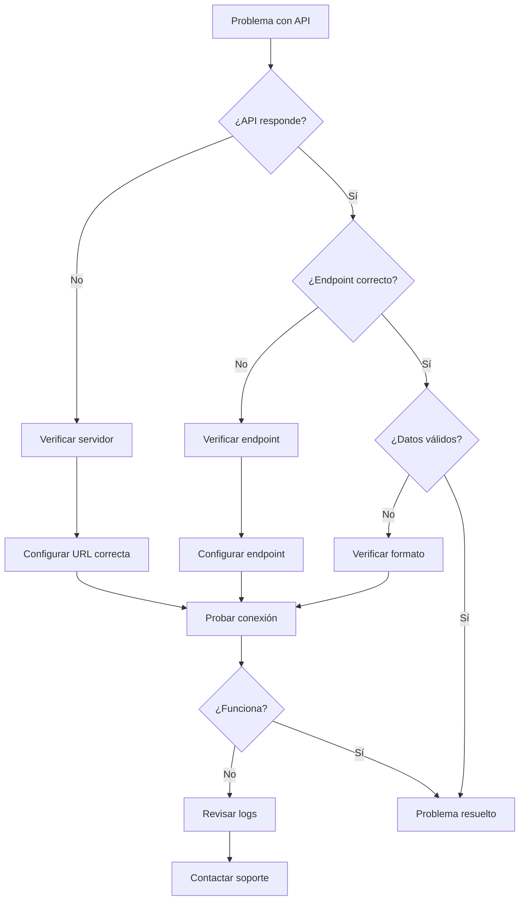

# 🔧 Solución de Problemas - API REST

Esta guía te ayudará a identificar y resolver problemas comunes con la conexión a la API REST.

## 📋 Problemas Comunes y Soluciones

### 1. **Error: `ECONNREFUSED 127.0.0.1:3000`**

**Síntomas:**

- El script no puede conectarse al servidor
- Error de conexión rechazada

**Causas posibles:**

- El servidor no está ejecutándose
- Puerto incorrecto
- URL incorrecta

**Soluciones:**

```bash
# 1. Verificar si el servidor está ejecutándose
curl http://localhost:3000/api

# 2. Verificar puertos abiertos
netstat -tulpn | grep :3000

# 3. Configurar la URL correcta
node scripts/configure-api.js
```

### 2. **Error: `ENOTFOUND api.example.com`**

**Síntomas:**

- El dominio no se puede resolver
- Error de DNS

**Causas posibles:**

- URL incorrecta
- Problemas de conectividad de red
- DNS no configurado

**Soluciones:**

```bash
# 1. Verificar conectividad
ping api.example.com

# 2. Verificar DNS
nslookup api.example.com

# 3. Configurar URL correcta
node scripts/configure-api.js
```

### 3. **Error: `Request failed with status code 400`**

**Síntomas:**

- La API responde pero rechaza la petición
- Error de validación de datos

**Causas posibles:**

- Formato de datos incorrecto
- Campos requeridos faltantes
- Autenticación incorrecta

**Soluciones:**

```bash
# 1. Diagnosticar el problema específico
node scripts/diagnose-api.js

# 2. Verificar formato de datos
# Revisar la estructura esperada por la API
```

### 4. **Error: `ETIMEDOUT`**

**Síntomas:**

- La conexión se agota por tiempo
- Respuesta lenta del servidor

**Causas posibles:**

- Servidor sobrecargado
- Conexión lenta
- Timeout muy bajo

**Soluciones:**

```bash
# 1. Aumentar timeout en la configuración
API_TIMEOUT=60000

# 2. Verificar rendimiento del servidor
# 3. Optimizar la conexión de red
```

## 🛠️ Herramientas de Diagnóstico

### Script de Diagnóstico Automático

```bash
# Ejecutar diagnóstico completo
node scripts/diagnose-api.js
```

Este script realizará:

- ✅ Verificación de conectividad básica
- ✅ Prueba de endpoint específico
- ✅ Envío de datos de prueba
- ✅ Análisis de respuestas

### Script de Configuración Interactiva

```bash
# Configurar API paso a paso
node scripts/configure-api.js
```

Este script te guiará para:

- 🌐 Configurar la URL base
- 🔑 Configurar API Key (si es necesaria)
- ⏱️ Configurar timeout
- 🔄 Configurar reintentos

## 📊 Verificación Manual

### 1. **Probar conectividad básica**

```bash
# Con curl
curl -v http://tu-api-url.com/api

# Con wget
wget --spider http://tu-api-url.com/api

# Con telnet (para verificar puerto)
telnet tu-api-url.com 80
```

### 2. **Probar endpoint específico**

```bash
# Probar con POST vacío
curl -X POST http://tu-api-url.com/api/up_compra.php \
  -H "Content-Type: application/json" \
  -d '{}'

# Probar con datos de ejemplo
curl -X POST http://tu-api-url.com/api/up_compra.php \
  -H "Content-Type: application/json" \
  -d '{
    "licitacion_id": "TEST-001",
    "nombre": "Prueba",
    "fecha_publicacion": "2024-01-01 10:00",
    "fecha_cierre": "2024-01-31 18:00",
    "organismo": "Test",
    "unidad": "Test",
    "monto_disponible": 1000000,
    "moneda": "CLP",
    "estado": "Publicada"
  }'
```

### 3. **Verificar logs**

```bash
# Ver logs de error
tail -f logs/app.error.log

# Ver logs generales
tail -f logs/app.log

# Buscar errores específicos
grep "API" logs/app.error.log
```

## 🔧 Configuración Avanzada

### Variables de Entorno Importantes

```bash
# URL base de la API
API_BASE_URL=http://tu-api-url.com/api

# Clave de autenticación (si es necesaria)
API_KEY=tu-api-key-aqui

# Timeout en milisegundos
API_TIMEOUT=30000

# Número de intentos de reintento
API_RETRY_ATTEMPTS=3
```

### Configuración de Proxy (si es necesaria)

```bash
# Si necesitas usar proxy
export HTTP_PROXY=http://proxy:puerto
export HTTPS_PROXY=http://proxy:puerto

# O configurar en el archivo .env
HTTP_PROXY=http://proxy:puerto
HTTPS_PROXY=http://proxy:puerto
```

## 🚨 Casos Especiales

### API con Autenticación Bearer

```bash
# Configurar en .env
API_KEY=tu-token-bearer

# El script automáticamente agregará el header:
# Authorization: Bearer tu-token-bearer
```

### API con Autenticación Basic

```bash
# Si tu API usa Basic Auth, modifica el ApiService.ts
# para incluir el header Authorization: Basic base64(username:password)
```

### API con CORS

```bash
# Si hay problemas de CORS, verifica que el servidor permita:
# - Origin de tu aplicación
# - Métodos HTTP necesarios (POST)
# - Headers Content-Type
```

## 📞 Contacto y Soporte

Si después de seguir esta guía sigues teniendo problemas:

1. **Ejecuta el diagnóstico completo:**

   ```bash
   node scripts/diagnose-api.js
   ```

2. **Revisa los logs detallados:**

   ```bash
   cat logs/app.error.log
   ```

3. **Verifica la configuración:**

   ```bash
   cat .env
   ```

4. **Proporciona la siguiente información:**
   - URL de la API
   - Código de error específico
   - Logs de error
   - Configuración actual

## 🔄 Flujo de Solución de Problemas



---

**💡 Consejo:** Siempre ejecuta `node scripts/diagnose-api.js` como primer paso para identificar el problema específico.
